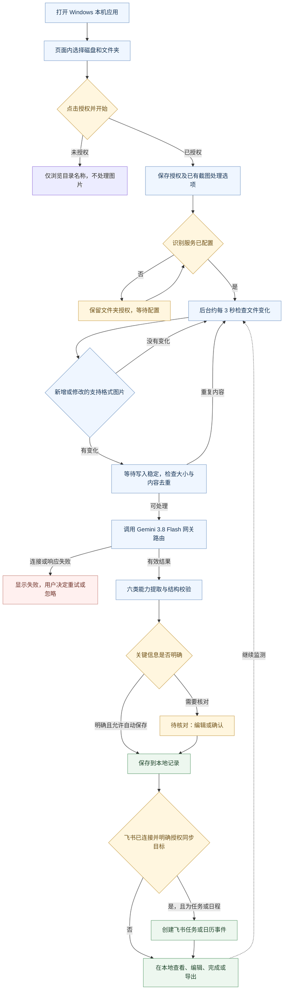

<div align="center">

# SnapFlow · AgentM

**让截图进入行动流程。**

Windows 相册截图 Agent · 文件夹授权 · 自动分类 · 飞书任务与日历

`Windows 首版开发中`　`Gemini 3.8 Flash`　`102 项后端检查`　`12 组浏览器检查`

[开始使用](#开始使用) · [项目流程](#项目流程) · [完成情况](#完成情况) · [下一步](#下一步) · [开发与验证](#开发与验证)

</div>

---

> **当前状态 · 2026-09-16**<br>
> 文件夹选择、自动监测、分类与本地保存已实现。Windows 独立连接检查已复现 TLS 握手提前断开（`SSLEOFError`），下一步对比默认代理与本次请求直连；根因尚未确定，真实使用闭环尚未验收。飞书真实账号同步也仍待验证。
>
> **当前唯一测试包**：[`SnapFlow-Windows-ConfigFix-20260914-165159.zip`](deliverables/snapflow/SnapFlow-Windows-ConfigFix-20260914-165159.zip)<br>
> 包名保持不变；当前内部代码版本为 `windows-folderwatch-20260914`。同名包可能已更新，请以 [`LATEST.json`](deliverables/snapflow/LATEST.json)、[SHA-256](deliverables/snapflow/SnapFlow-Windows-ConfigFix-20260914-165159.sha256) 和 Git 提交记录区分内容。

## 产品做什么

用户选择一个截图文件夹并授权，SnapFlow 持续检查新截图和内容发生变化的截图。模型提取信息，按六类能力整理；信息明确的内容保存为记录，缺关键信息的事项交给用户核对。用户连接飞书并确认同步目标后，可进一步创建任务和日程。

| 能力 | 常见输入 | 当前处理方式 |
| :--- | :--- | :--- |
| **任务** | 聊天里的工作要求、项目安排 | 提取行动内容和明确期限 |
| **待办** | 取件、缴费、报名提醒 | 整理成可完成的事项 |
| **作业** | PPT、课程群、提交要求 | 记录课程、执行清单和截止信息 |
| **日程** | 活动海报、会议通知 | 提取时间地点；关键时间缺失时待核对 |
| **灵感** | 创意、设计参考、有趣想法 | 保存为可检索的收藏 |
| **资料** | 教程、信息截图、无行动要求的内容 | 概括并归档，不凭空生成任务 |

## 项目流程



**运行边界**：当前只监测所选文件夹这一层，支持 PNG/JPG/JPEG/WebP，单张最多 8 MB。需在连续检查中确认文件稳定，识别完成时间还取决于网关响应。关闭网页后后台可以继续运行；关闭后台、休眠或关机后暂停。原图不移动、不删除，失败的模型请求不自动重试。

## 完成情况

这里将“代码已实现”“离线检查通过”和“Windows 真实使用已验收”分开记录。

| 模块 | 当前进展 | 尚需确认或修改 |
| :--- | :--- | :--- |
| **启动与页面** | 本机启动、自动选端口、启动诊断已实现；指定首页提示已移除 | 在目标 Windows 完成重启与升级验收 |
| **文件夹授权** | 页内磁盘/目录浏览、上一级导航、明确授权、暂停/继续/撤销已实现 | 确认目标电脑更新生效、驱动器和路径可正常浏览 |
| **自动监测** | 约 3 秒检查；稳定写入、内容去重、同名修改处理及重启保留授权已实现 | 在用户真实相册中跑通持续处理 |
| **Gemini 接入** | 默认路由 `gemini-3.8-flash`，已有配置继承与独立保存已实现 | **Windows 独立检查出现 TLS 握手提前断开**，待对比代理与直连；配置存在不等于调用成功 |
| **分类与本地记录** | 六类处理、自动保存、待核对、编辑、搜索及批量上传已实现 | 用用户实际截图验证准确性并修正误分类 |
| **飞书与日程** | OAuth、目标选择、任务/日程创建接口及自动同步授权已实现；支持日历文件导出 | 真实账号的权限、时间、创建结果和重复同步验收 |
| **调用与预算** | 记录调用状态、模型、部分 token 信息及预算规则 | 未接通可靠人民币费用数据；不能声称已自动执行额度扩充 |
| **交付与版本管理** | 当前测试包、校验、Git 保存流程和进度文档已建立 | 合并现有更新入口，减少用户手动安装和配置步骤 |

### 验证依据

- **2026-09-14 功能回归：102 项后端/HTTP/启动检查，12 组 Chrome 离线交互通过。** 包括运行中的监测线程、新增/修改、暂停/撤销、目录浏览、授权边界和窄屏布局。
- **历史云端模型检验：15 张样例、15 次有效响应、15 次通过预设规则检查。** 回放产生 20 条事项，其中 17 条自动保存、3 条待核对。这是限定样例上的历史结果，不能代表全部真实截图准确率。
- 最新文件夹更新未新增真实模型调用。Windows 更新文件传输成功，不等于已在目标电脑执行成功。
- 详细证据见 [当前验证报告](snapflow/verification/album-agent-20260914/REPORT.md) 与 [验证清单](snapflow/verification/album-agent-20260914/RELEASE_VALIDATION.json)。

## 下一步

按“先打通真实处理，再完善体验”的顺序推进：

| 优先级 | 工作 | 完成标准 |
| :---: | :--- | :--- |
| **P0** | 定位 Windows 的 TLS 握手断开 | 对比默认代理与请求级直连的结果，确定原因；修复后成功识别一张真实截图 |
| **P0** | 打通文件夹自动处理闭环 | 一次授权后连续新增多张截图，结果自动出现；修改、暂停、恢复、重启均符合预期 |
| **P1** | 真实截图质量验收 | 覆盖聊天、作业、海报、待办、灵感和资料；关键字段可核对，不编造日期或事项 |
| **P1** | 飞书端到端验收 | 用真实账号创建一条任务和一个日程，核对时间、目标及重复操作行为 |
| **P1** | 细化连接错误和处理状态 | 区分网络、证书、权限、额度和返回格式问题，给出可执行的下一步 |
| **P2** | 统一安装、更新与配置 | 一个明确的启动入口；升级保留密钥、文件夹授权和记录，无需拼装多个补丁 |
| **P2** | 完成费用核算 | 获得网关费用依据，再验证预算统计与扩充逻辑 |

当前故障细节和交接记录见 [PROJECT_STATUS.md](PROJECT_STATUS.md)。

## 开始使用

1. 获取[当前测试包](deliverables/snapflow/SnapFlow-Windows-ConfigFix-20260914-165159.zip)，**完整解压**到 Windows 项目目录。首次运行需要已有 Python 3.10+。
2. 打开程序文件夹，双击 `start-windows.cmd`，保留后台运行。
3. 在“设置与连接”检查识别服务。已有 `api_key.json` 或旧版私有配置可被读取，成功读取后在项目 `.snapflow-config/` 保留配置。**仓库和安装包不包含真实密钥。**
4. 点击“授权截图文件夹”，进入目标目录并点击“授权并开始”。默认同时处理已有截图，可取消该选项。
5. 放入一张测试截图，确认产生有效结果后再增加测试量。当前 Windows 连接错误仍未解决，不能仅凭“已连接”状态认定识别可用。

已有安装的升级应保留 `data/`、`.snapflow-config/` 和密钥文件；不要删除这些目录来解决启动问题。更详细的配置和飞书说明见 [应用使用说明](snapflow/README.md)。

## 代码结构

```text
AgentM/
├── README.md                 项目首页、流程与进度
├── PROJECT_STATUS.md         当前问题、验证边界与下一步
├── AGENTS.md                 开发、同步文档与版本保存约定
├── snapflow/
│   ├── server.py             本机 HTTP 接口、模型调用、数据与鉴权
│   ├── agent_engine.py       文件夹授权、监测、去重和自动保存
│   ├── native_album.py       目录浏览；保留旧选择器兼容接口
│   ├── skills_engine.py      六类能力与结果校验
│   ├── batch.py              识别队列及批量处理
│   ├── vision_settings.py    配置发现、继承与持久化
│   ├── feishu.py             飞书授权、任务和日历
│   ├── launcher.py           Windows 启动、端口与诊断
│   ├── static/               页面、交互与样式
│   ├── tests/                离线回归
│   └── verification/         已核对的验证报告
├── tools/                    模型调用与开发工具
└── deliverables/              当前测试包及产品文档
```

用户数据、私有配置、原始排障图片、缓存和历史恢复归档留在本机，不进入 Git 历史。这里只展示当前维护的主要模块。

## 开发与验证

在项目根目录执行离线测试，不需要真实密钥：

```bash
SNAPFLOW_TEST_OUTPUT="$PWD/tmp/local-tests" PYTHONDONTWRITEBYTECODE=1 \
  python3 -m unittest discover -s snapflow/tests -p 'test_*.py'
```

测试需要允许本机回环 HTTP 监听。浏览器交互使用 Chrome 离线测试环境，原始测试产物保留在 `tmp/`。预计超过 60 秒的任务使用 tmux 并通过 tee 保存日志；真实模型检验遵守项目的云端执行约束。

**保存约定**：每次取得可复核的进展后，检查改动和适当验证，同步本 README 与 `PROJECT_STATUS.md`，提交并推送到 GitHub。提交记录保存每一阶段；不强制推送，不把未验收事项写成已完成。具体约定见 [AGENTS.md](AGENTS.md)。

## 项目资料

- [产品定义 Word](deliverables/snapflow/SnapFlow_截图行动Agent_产品定义_V0.1.docx)
- [竞品分析 Word](deliverables/snapflow/SnapFlow_竞品分析_20260914.docx) · [PDF](deliverables/snapflow/SnapFlow_竞品分析_20260914.pdf)
- [模型调用说明](vlm-advanced-20260909/CALLING.md) · [历史模型报告](vlm-advanced-20260909/REPORT.md)
- [当前状态与交接](PROJECT_STATUS.md)
